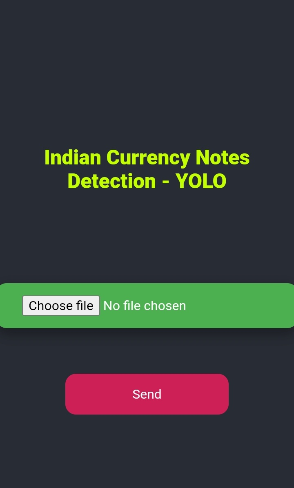
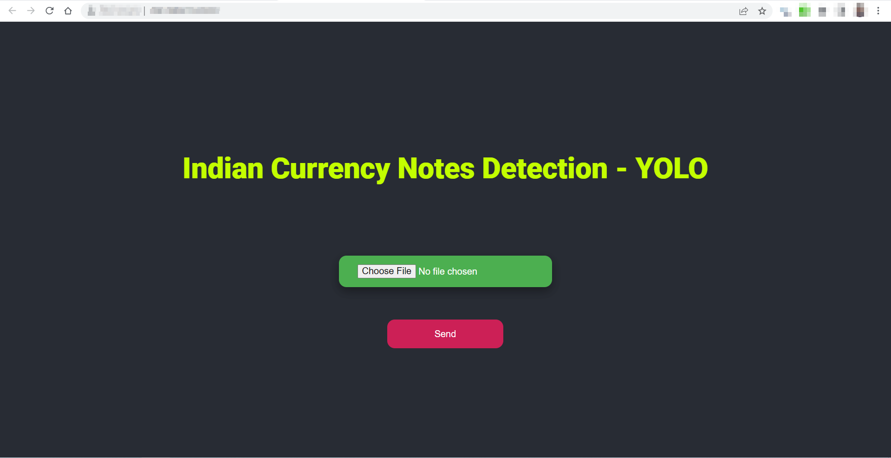
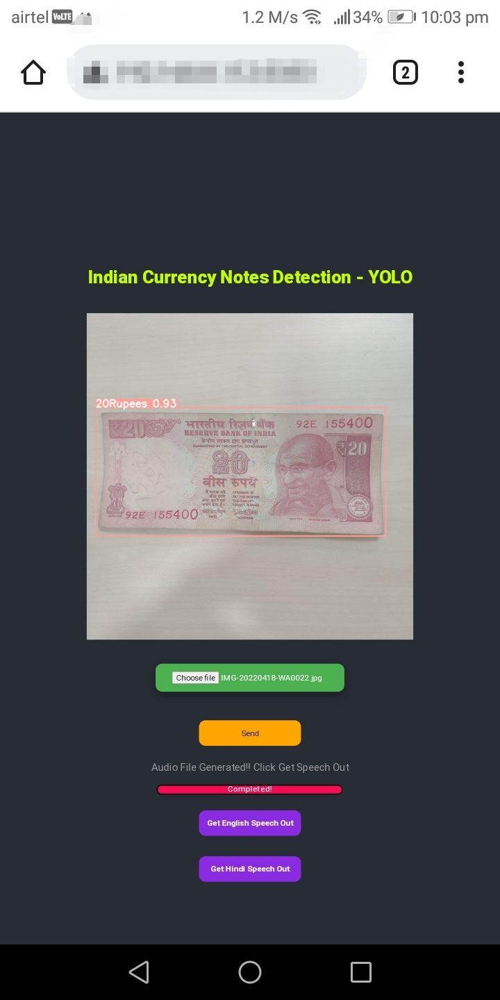
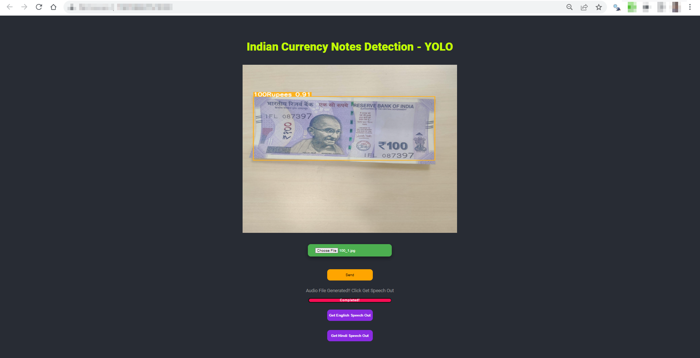

# IndianCurrencyNotesDetection

## A web application made for Indian Currency Notes Detection using YOLOv5.
---
### Web Application available [here](https://ugrdsa.pythonanywhere.com/)
---

# Objective/Purpose
- In India, Indian Currency Recognition System currently uses CNN and OpenCV based recognition systems to detect currency notes. This model has lower detection accuracy than the proposed system which uses YOLOv5 for object detection.

- Our App also serves the tourists and other foreigners in India to know the currency they possess which also helps them from fraudsters.

- Our app also provides **audio outputs** which helps Visually Impaired people.
---

# Local machine setup for working application

## Requirements

- Text-Editor: VScode/SublimeText/VS (any modern editor)
- Python >= 3.7
- Git >= 2.25.1 (Not mandatory)
- Linux/Windows (Currently, pytorch is not available for macOS).
- For Windows users install torch from [here](https://pytorch.org/) and 
configure it using this [link](https://www.geeksforgeeks.org/install-pytorch-on-windows/).
- Instead I recommend to use `wsl(Windows Subsytem For Linux)`. Find [here](https://docs.microsoft.com/en-us/windows/wsl/install) for installation which provides Linux CLI.
- For Linux OS, it is installed in command line during installation using `requirements.txt`
---
## Steps

1. Visit Git repository from [here](https://github.com/Gowtham-369/IndianCurrencyNotesDetection) 
2. You can download code in zip format from above link or
Run `git clone https://github.com/Gowtham-369/IndianCurrencyNotesDetection.git` 
within terminal/CMD
3. Create a virtual env for this project
using [this link](https://docs.python.org/3/tutorial/venv.html) and [this link](https://docs.python.org/3/library/venv.html) and activate virtual environment for this project
4. Open terminal/CMD in current working directory
5. Now, Install dependencies using `pip install -r requirements.txt` .
<mark>Ensure successfull installation of all dependencies</mark>

6. Now, type `ipconfig/ifconfig` in `windows/linux` respectively. Copy and paste ipv4 address in "\_\_main\_\_" section in [line number 92](./app.py)  in app.py file and also update the url value in [line number 19](./static/index.js) of ajax call in index.js file
 
7. Run `python3 app.py` in terminal/cmd
8. Now, flask localserver opens up in console, click it.
Boom! :star2: :joy: Go to webpage directed from localhost and run your app.

9. *To use web app on your mobile, connect the mobile to the same wifi/ethernet to which Computer is connected and open the same url in Modern Browsers like Chrome/FireFox/MSEdge/Safari.*

---

## Sample App Results

